<div align="center">

[中文](./README.zh.md) · **English**

# 📄 Resume Skill

---

**One resume data schema, eleven print-ready templates.**

[](./LICENSE)
[]()
[]()
[](https://github.com/tsaoamy/offer-toolkit-skill/tree/main/resume-skill/stargazers)

[](https://claude.ai/code)
[]()
[]()
[]()
[]()

</div>

> 📦 Part of the **[offer-toolkit-skill](https://github.com/tsaoamy/offer-toolkit-skill)** — the full job-hunt bundle (JD · Resume · BQ). Install the bundle to get all three in one shot.

An agent skill that polishes an existing resume, pulls one in from LinkedIn, or builds one from scratch by chatting with you. Every input funnels through one standardized data schema and then renders into any of 13 print-ready templates — switching templates is just a skin change, the content stays the same.

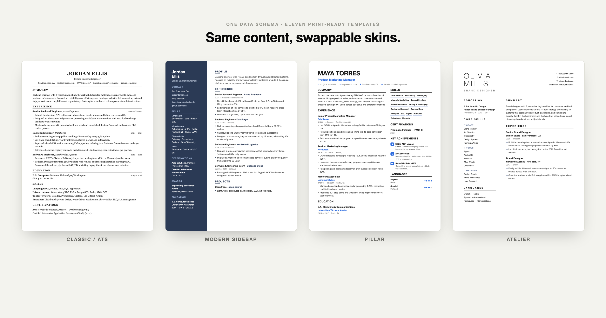

---

## Three entry points

| What the user says | Flow | Script |
|---|---|---|
| *"Beautify my resume"* / uploads a PDF/docx/txt | **A. Beautify an existing resume** | [`prompts/beautify.md`](prompts/beautify.md) |
| *"Here's my LinkedIn"* / pastes a linkedin.com link | **B. LinkedIn import** | [`prompts/linkedin-import.md`](prompts/linkedin-import.md) |
| *"Build me one from scratch"* / *"let's chat"* | **C. Conversational build** | [`prompts/interview.md`](prompts/interview.md) |

All three funnel into [`schema/resume-data.md`](schema/resume-data.md), then render through a template.

## Thirteen templates

| Preview | Template | Best for |
|:---:|---|---|
| 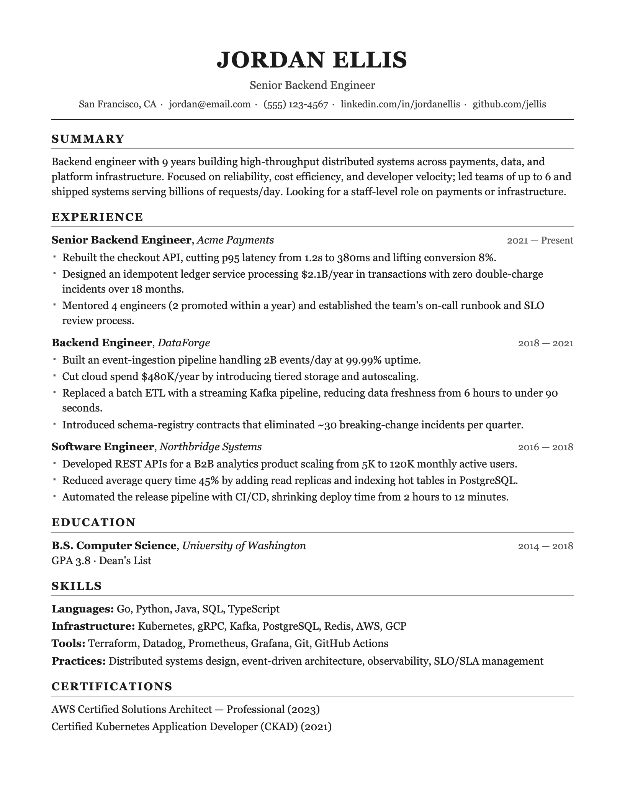 | **Classic / ATS**<br>[`classic-ats.html`](templates/classic-ats.html) | Single-column, machine-parseable, safest for mass applications |
| 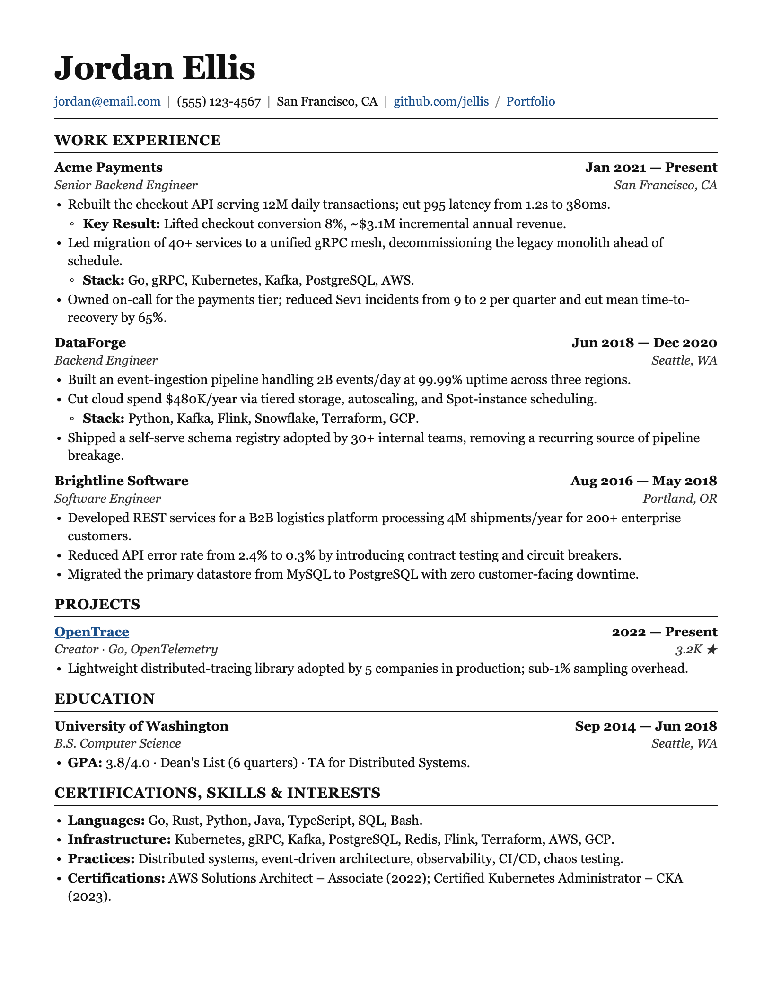 | **Ledger**<br>[`ledger.html`](templates/ledger.html) | LaTeX-style serif, justified, nested bullets — SWE / data / eng |
|  | **Tech Compact**<br>[`tech-compact.html`](templates/tech-compact.html) | High density + mono accents, fits many projects on one page |
| 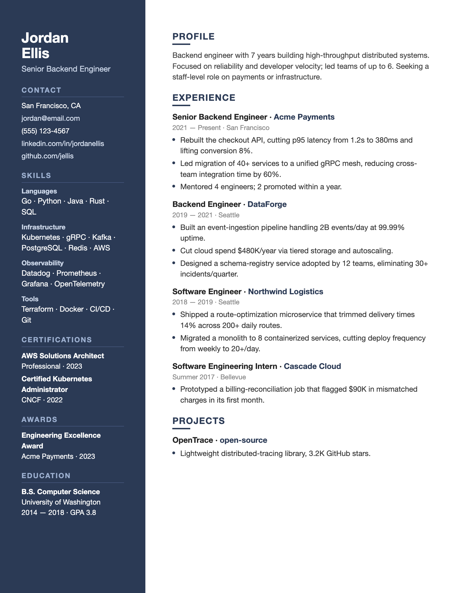 | **Modern Sidebar**<br>[`modern-sidebar.html`](templates/modern-sidebar.html) | Two-column with dark sidebar, modern feel |
|  | **Pillar**<br>[`pillar.html`](templates/pillar.html) | Enhancv-style, blue accents + skill chips + icon achievements — PM / marketing |
| 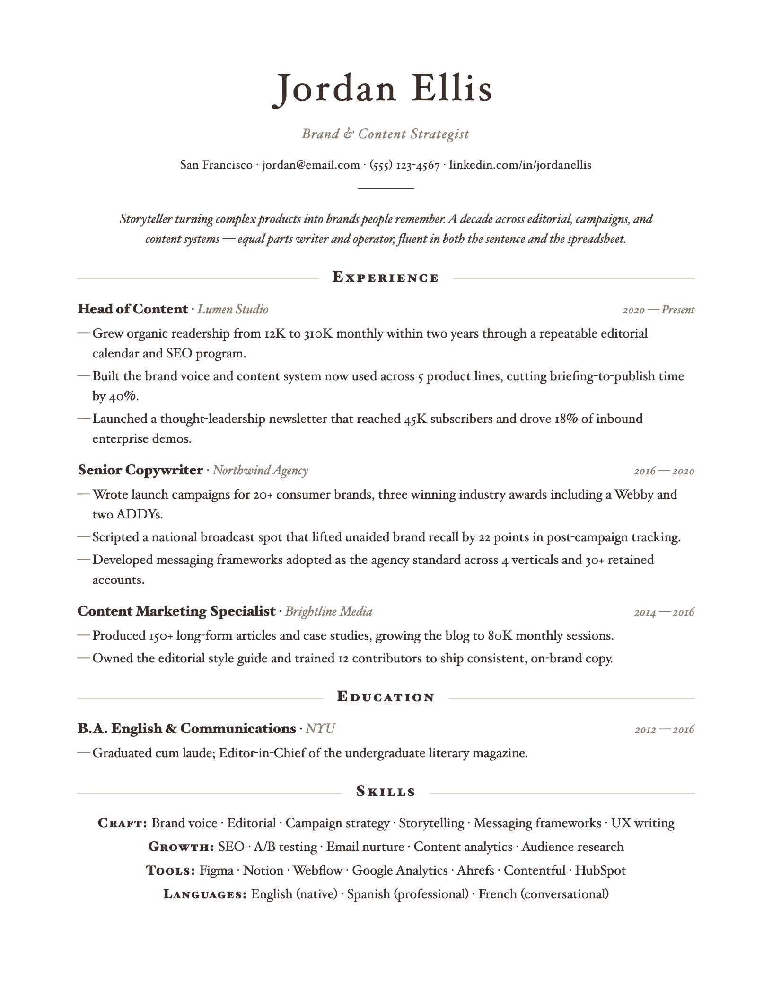 | **Elegant Serif**<br>[`elegant-serif.html`](templates/elegant-serif.html) | Centered editorial serif — design / consulting / marketing |
| 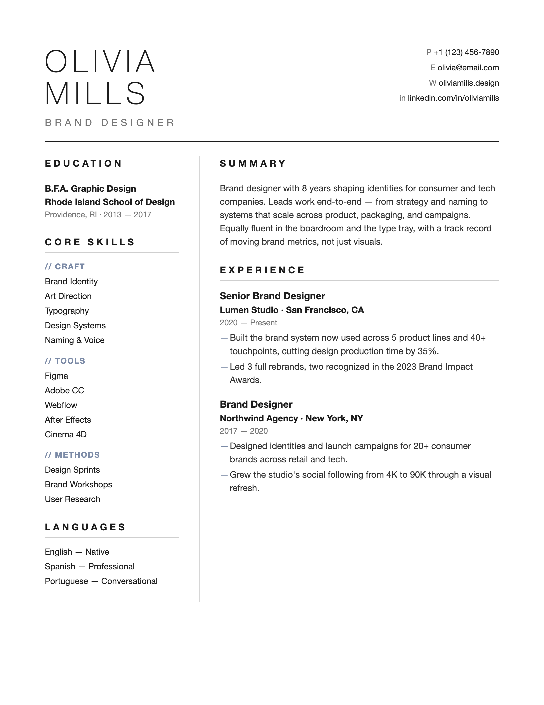 | **Atelier**<br>[`atelier.html`](templates/atelier.html) | Whitespace-heavy minimal — design / creative roles |
| 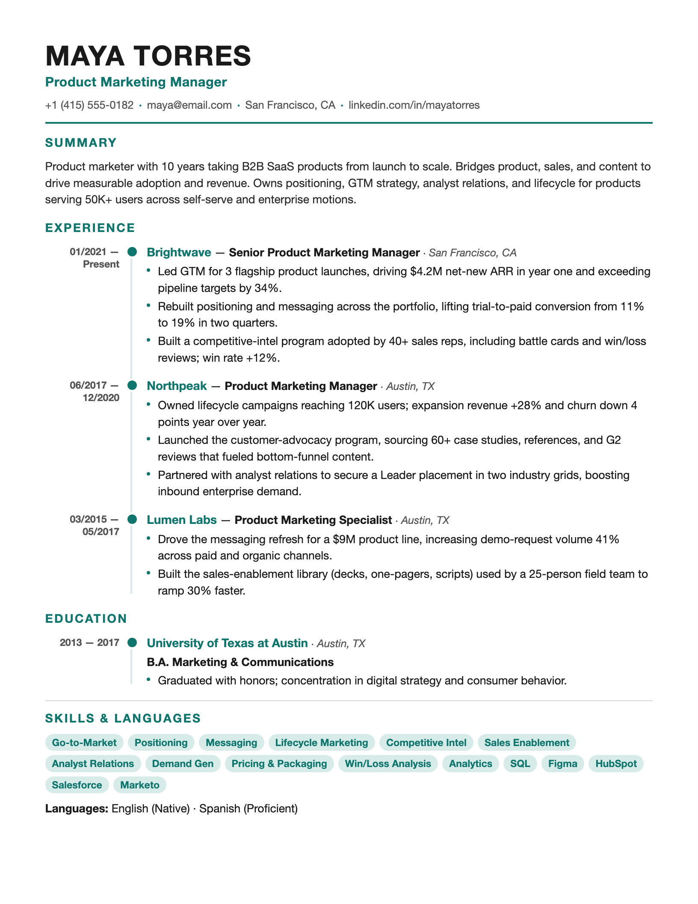 | **Timeline**<br>[`timeline.html`](templates/timeline.html) | Vertical timeline spine — shows career progression at a glance |
| 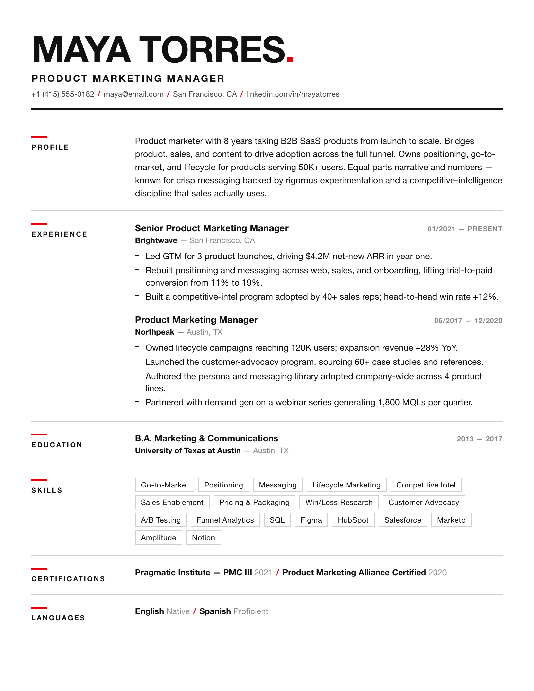 | **Swiss**<br>[`swiss.html`](templates/swiss.html) | Swiss grid, bold Helvetica + red accent — design / brand / creative |
| 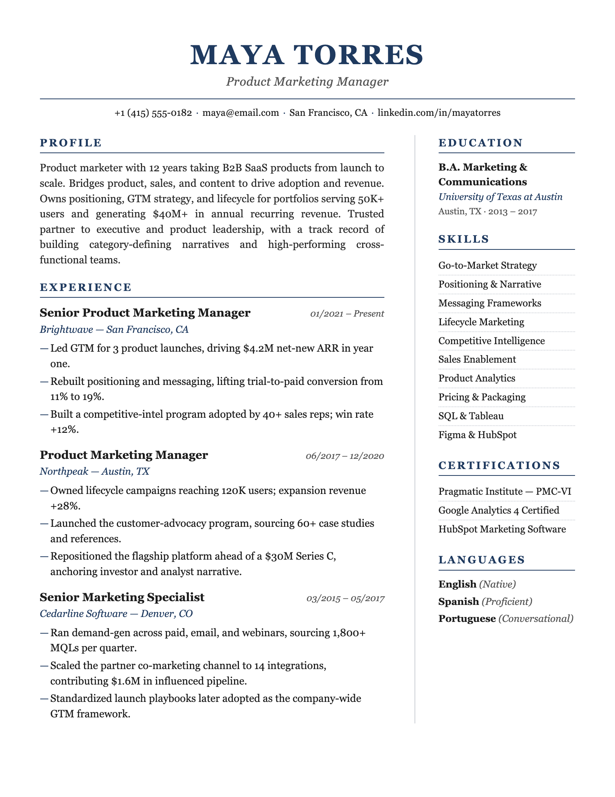 | **Executive**<br>[`executive.html`](templates/executive.html) | Navy serif, understated gravitas — finance / consulting / senior leaders |
| 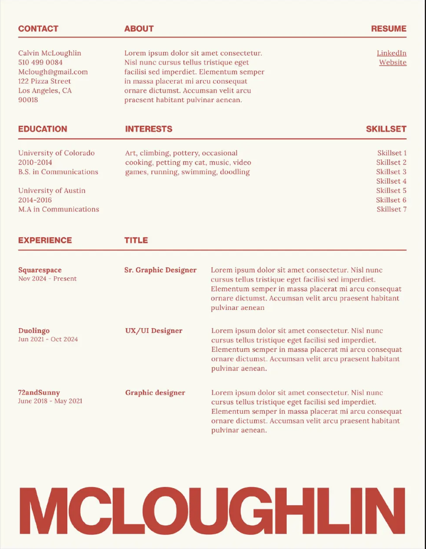 | **Editorial Banner**<br>[`editorial-banner.html`](templates/editorial-banner.html) | Magazine-style 3-col header, red serif accent, giant last-name band at the bottom — brand / content / editorial |
| 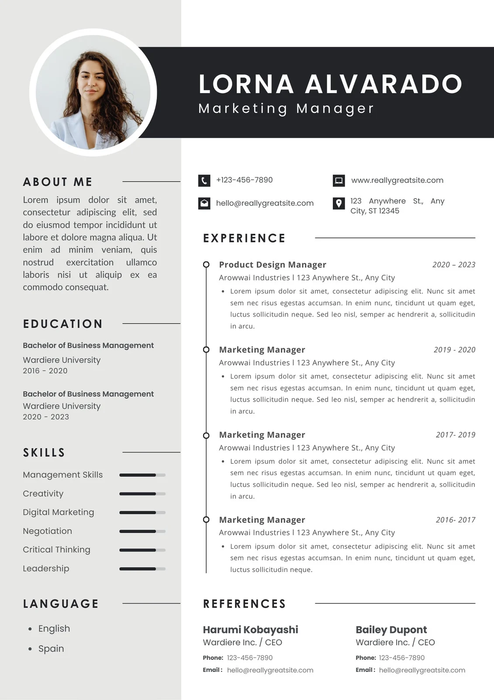 | **Photo Corporate**<br>[`photo-corporate.html`](templates/photo-corporate.html) | Dark banner + circular photo, sidebar with skill bars, vertical timeline, References section — marketing / PM / business |
| 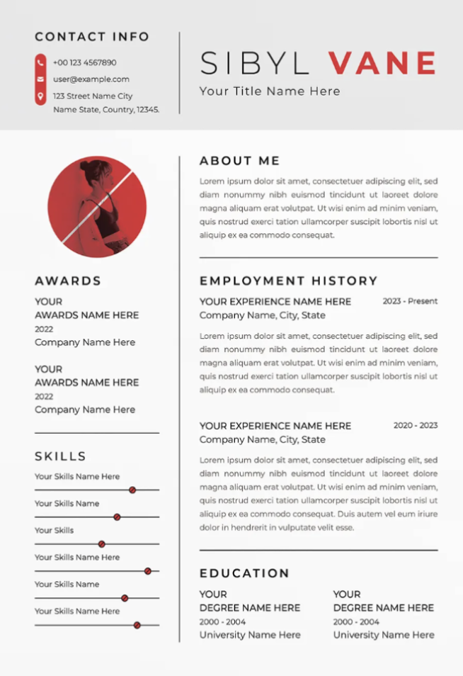 | **Photo Minimal**<br>[`photo-minimal.html`](templates/photo-minimal.html) | Red-accent split serif name, circular photo, Awards + Skills sidebar — designer / creator / portfolio |

**Picking one:** mass-applying / passing the bots → Classic-ATS or Ledger; a human reads it / referral / portfolio-facing → the others stand out more.

## Three first principles

1. **Never fabricate.** Every experience, responsibility and number comes from what the user actually provided. Guide, probe, sharpen weak bullets — but never invent a company, title, result, or metric. Verify every number; mark unknowns `[to confirm]`.
2. **One question at a time.** Building a resume by conversation is an interview, not a questionnaire.
3. **Structure first, render second.** Whatever the entry point, organize content into the `schema/resume-data.md` fields and confirm it before rendering HTML.

## Editable variant — click any text to edit

Every render produces **two files**:

| File | Use |
|---|---|
| `<name>-resume-<template>.html` | Locked print-ready output — `Cmd+P` → PDF |
| `<name>-resume-<template>-editable.html` | Click any text in the browser to edit; `Cmd+P` when done |

The editable variant layers three things on top of any template (see [`prompts/editable-version.md`](prompts/editable-version.md)) without touching its visual design:

- `contenteditable="true"` on the content container
- Hover / focus affordance (dashed yellow → solid blue outline)
- A floating toolbar (top-right) with **Save as PDF** and **Lock** buttons
- `@media print` hides the toolbar and edit highlights so the exported PDF stays clean

⚠️ Browser edits live only in the current tab — refresh and they're gone. Always `Cmd+P` to lock changes into a PDF.

## Usage

Drop the whole `resume-skill/` folder into your skills directory (e.g. `~/.claude/skills/resume-skill/`) and just say *"beautify this resume"* (attach a PDF), *"I have no resume, let's build one"*, or *"here's my LinkedIn, make me one."* Claude reads `SKILL.md` and runs the matching flow.

**Output:** two self-contained single-file HTMLs — `<name>-resume-<template>.html` (locked) and `<name>-resume-<template>-editable.html` (click-to-edit). Open either in a browser → `Cmd+P` → Save as PDF (margins None/Default, **enable background graphics**).

## Layout
```
resume-skill/
├── SKILL.md                       # Workflow entry point (read first)
├── schema/resume-data.md          # Standardized fields — the hub format for every entry point
├── prompts/
│   ├── beautify.md                # Entry A: beautify an existing resume
│   ├── linkedin-import.md         # Entry B: LinkedIn import + fallback
│   ├── interview.md               # Entry C: conversational collection
│   └── editable-version.md        # Injection snippet that upgrades any render into a click-to-edit page
├── guides/writing-tips.md         # Bullet craft, quantification, ATS keywords, common mistakes
└── templates/                     # 13 print-optimized HTML templates
```

## Related skills
- [offer-toolkit-skill](https://github.com/tsaoamy/offer-toolkit-skill) — the all-in-one bundle (JD · Resume · BQ)
- [job-description-skill](https://github.com/tsaoamy/offer-toolkit-skill/tree/main/job-description-skill) — Job Description Decoder
- [Behavior-question-skill](https://github.com/tsaoamy/offer-toolkit-skill/tree/main/bq-skill) — Behavioral interview / story bank

## License

MIT — fork it, remix it, ship your own version.

Maintained by [Rick (@tsaoamy)](https://github.com/tsaoamy)
